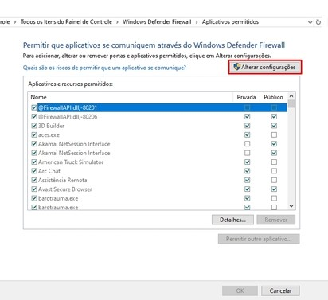
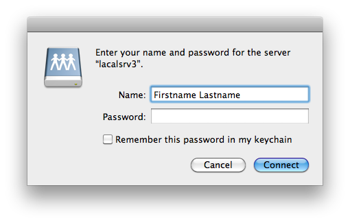

# Tutorial de Conexão Remota

## Formas de Conexão

### Pelo link do NAS

A conexão direta pelo link do NAS é feita digitando na barra de qualquer navegador:

https://nas-gutorequena.ezconnect.to/

Este acesso se dará pela interface gráfica semelhante ao google drive, mas diferente da forma integrada a qual temos acesso no estúdio. Os arquivos terão de ser baixados no computador para serem alterados, assim como para atualiza-los terá de ser feito um upload do arquivo para o servidor.

**Tomar cuidado com modificações simultaneas no mesmo arquivo, como eles serão "sobrepostos" quando forem enviados novamente para NAS as modificações feitas por outas pessoas anteriormente podem ser perdidas. Sincronizem-se para evitar isso**

*Essa conexão é a mais simples a ser feita, com uma segurança quase equivalente a uma transação bancária.*

A senha e usuário padrão para conexão é:

### Conexão por VPN:

A conexão por VPN é basicamente uma simulação completa do ambiente de rede que temos no estúdio, dessa forma é possível "montar" o NAS no computador e usá-lo como se fosse um segundo HD, igual fazemos diariamente.

Uma VPN (*Virtual Private Network*) é uma rede virtual por onde os computadores de diversos locais podem se comunicar como se estivessem numa mesma sala, sendo esta sala fechada e todos "falando em um código que apenas eles sabem entre si" (aka criptografia). Este meio de comunicar com o NAS é mais seguro que uma transação bancária até mesmo.

Para se conectar à VPN do estúdio precisaremos baixar um programa chamado *Zerotier*.

Este tutorial cobre o sistema operacional windows 10 e macOS (apesar de eu nao ter podido testar pois não tenho um Mac). Outras versões de windows são semelhantes, portanto acredito que funcione para elas também.

#### Passo a Passo Windows 10

##### Configurar o Zerotier

 - Baixar o Zerotier pelo link: https://download.zerotier.com/dist/ZeroTier%20One.msi

 - Executar o programa baixado e prosseguir com a instalação naturalmente

 - Ao terminar a instalação permita que o Zerotier seja executado

 - Clique sobre o icone do zerotier:

 

 que aparece junto a aba do relogio do windows

 - Na janela que surge selecione a opção **join Network...**.

 

 - Na caixa que aparecerá insira o código: **1d7193940454fcec** (exatamente como está escrito aqui)

 

 - Garanta que apenas esteja marcada a opção **Allow Managed**

 - Clique em **Join**

- Após feito isso, provavelmente sera exibida uma aba solicitando para permitir a descoberta na rede, selecione a opção **sim**. Caso não apareça essa aba não se preocupe.

- No mesmo icone do zerotier junto ao relógio do windows, se clicar novamente aparecerá um campo chamado **Node ID**

- Nele constará um código que identificará sua máquina. Assim que o obtiver envie-o para mim para que eu possa saber de quem é a máquina que esta conectada a rede. (por razões de seguraça e para fazer a manutenção futura na máquina caso ocorra algum problema).

- Feito isso, por segurança o administrador da VPN (O Bruno aqui que vos fala), necessita permitir o acesso.

Ainda no ícone junto ao relógio, clique sobre ele e selecione a aba **Preferences** e deixe habilitado a flag **Lauch ZeroTier On Startup**.

##### Configurar o Firewall

Na busca do windows, busque por **permitir um aplicativo pelo firewall**

Na janela que vai abrir clique em **Alterar configurações**

Na sequência localize na lista os aplicativos **ZeroTier One**, **ZeroTier One x64 Binary** e **ZeroTierOne**. Para todos estes deixe todas as opções habilitadas. De **ok** e saia da tela.

##### Testar

No navegador digite link: http://192.168.196.156

Se aparecer uma página escrito ***Apache2 Debian Default Page*** quer dizer que tudo funcionou perfeitamente!

#### Conectar ao NAS pela VPN

Na VPN existem duas formas de se conectar ao NAS, por meio de um link (semelhante ao método anterior) e por meio do método que usamos no estúdio "montando" o NAS no computador. Ambos são muito mais rápidos e estáveis que o metodo apenas pelo link.

##### Conexão via link (pela VPN)

***Esse link so funciona com a VPN ja configurada***

Digitar no navegador o seguinte link: http://192.168.196.156:8000

Este link deve levar a tela de login do NAS.

##### Montar o NAS

- Abrir uma pasta qualquer e na aba lateral direita clicar com o botão direito sobre o ícone **redes**.

- No menu que vai abrir, selecionar a aba **Mapear Unidade de Rede**

- No campo a ser preenchido escrever: *\\\\192.168.196.156\\EGR_Essential*

- Lembrar de selecionar os campos **Reconectar-se na entrada** e **Conectar usando credenciais diferentes**

- Clicar em **Concluir**

- Será então perguntado sobre login e senha, e para uso remoto temos
disponível:

(Prestar atenção aos maiúsculos e minúsculos da senha), para o **Financeiro**, as credenciais são diferentes, como já avisados.

- Deixar selecionada a opção **Lembrar minhas credenciais** e então clicar em **ok**

- Apartir deste momento o NAS deve aparecer conectado, igual temos nos PC's do estúdio.

#### Passo a Passo MacOS

##### Configurar o Zerotier

- Baixar o Zerotier pelo link: https://download.zerotier.com/dist/ZeroTier%20One.pkg

- Executar o programa baixado e prosseguir com a instalação naturalmente. Uma vez o programa instalado, execute-o.

- Clicar sobre o icone do ZeroTier  que aparecerá na barra superior a direita no Mac.

- Na janela que abrirá clicar em **Join Network..** e no campo **Enter network ID** inserir o código: **1d7193940454fcec** (exatamente como está escrito aqui)

***Prestar atenção que o codigo que esta na imagem abaixo é diferente do que usaremos***

- Garanta que apenas esteja marcada a opção **Allow Managed**

- Clique em **Join**

- Após esse passo, se clicarmos novamente no ícone teremos o campo **Node ID** que possui o código que corresponde a sua máquina.
Assim que o obtiver envie-o para mim para que eu possa saber de quem é a máquina que esta conectada a rede. (por razões de seguraça e para fazer a manutenção futura na máquina caso ocorra algum problema)

- Feito isso, por segurança o administrador da VPN (O Bruno aqui que vos fala), necessita permitir o acesso.

- Neste ponto o zeroTier já estara configurado.

##### Testar

No navegador digite link: http://192.168.196.156

Se aparecer uma página escrito ***Apache2 Debian Default Page*** quer dizer que tudo funcionou perfeitamente!

(***Este tutorial para Mac foi criado a partir de tutoriais on-line, não pude testá-lo pessoalmente por não ter um Mac a disposição. Se hover problemas ou o teste não funcionar, contate-me***)

##### Conexão via link (pela VPN)

***Esse link so funciona com a VPN ja configurada***

Digitar no navegador o seguinte link: http://192.168.196.156:8000

Este link deve levar a tela de login do NAS

##### Montar o NAS

- No menu do Finder do Mac selecione **Go**

- Abrir-se-á uma tela que possui um campo denominado *Server Address*, nele preencha com o seguinte link:

*smb://192.168.196.156/EGR_Essential*

- Clicar em **Connect**

- A tela de credenciais se abrirá se tudo correr bem, nela, no campo **name** colocaremos o nome do usuário e em **password** a senha

(Prestar atenção aos maiúsculos e minúsculos da senha), para o **Financeiro**, as credenciais são diferentes, como já avisados.

- Deixar habilitado o campo **remember this password in my keychain**.

- Clicar em **Connect**, se tudo correr bem, o NAS estará montado perfeitamente!

### Segurança

Apesar de falarmos em vários níveis de segurança elevados aqui vale sempre lembrar regras básicas como:

- Manter o antivirus atualizado (em caso de windows)
- Evitar sites estranhos (torrents, downloads de cracks)
- Evitar manter os arquivos desnecessariamente no HD do computador pessoal
- Quando se utilizando da VPN, se não estiver trabalhando, desligar-se da VPN
- Evitar logar no NAS por meio do método do link utilizando-se de wifi público (aeroporto, starbucks, wifi livres, etc)
